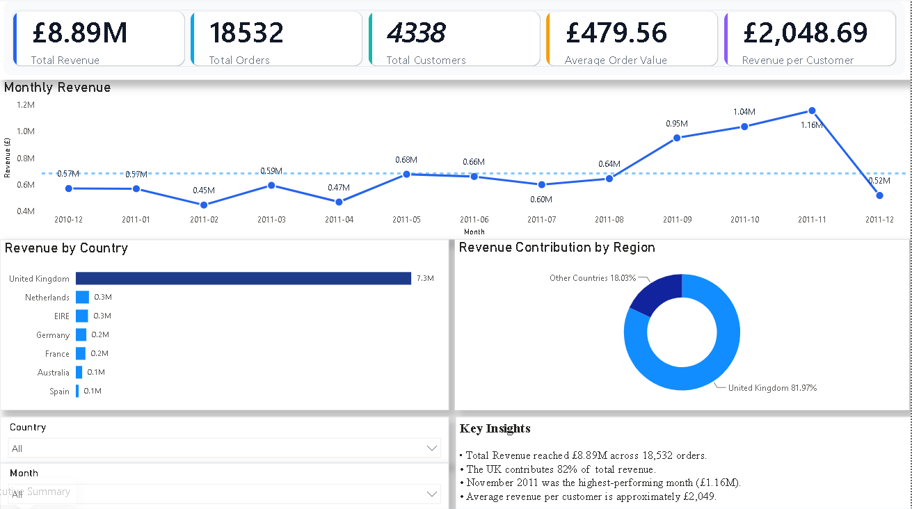
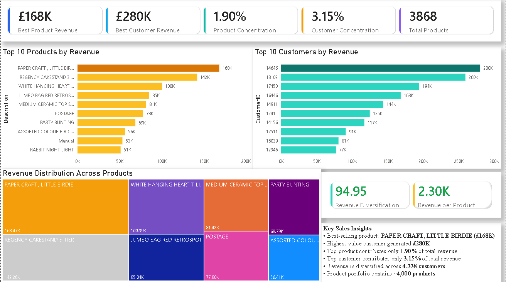
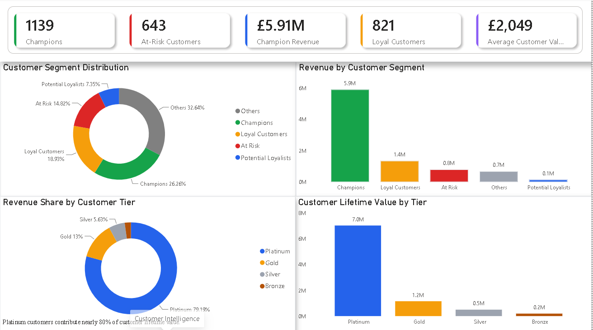
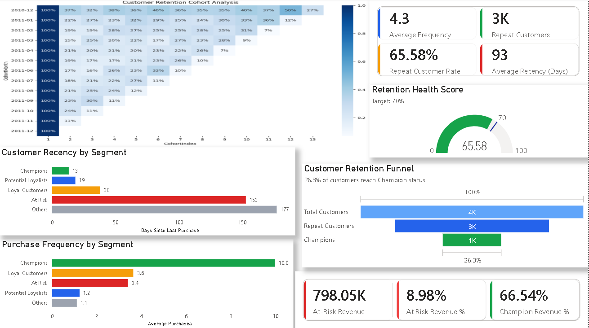

# Customer Intelligence Platform

## Project Overview

This project analyzes customer purchasing behavior using Python, SQL, and Power BI. The objective is to identify valuable customer segments, measure customer lifetime value (CLV), analyze retention patterns, and generate actionable business insights through interactive dashboards.

---

## Tech Stack

- Python (Pandas, NumPy)
- SQL
- Power BI
- Jupyter/Google Colab

---

## Project Workflow

1. Data Cleaning & Preprocessing
2. Feature Engineering
3. Exploratory Data Analysis (EDA)
4. RFM Analysis
5. Customer Segmentation
6. Customer Lifetime Value (CLV) Analysis
7. Business KPI Analysis
8. Power BI Dashboard Development

---

## Dataset

Online Retail Dataset

Processed Files:

- `cleaned_online_retail.csv`
- `customer_segments.csv`
- `clv.csv`

---

## Key Business Metrics

- Total Revenue: £8.89M
- Total Orders: 18,532
- Total Customers: 4,338
- Average Order Value: £479.56
- Revenue per Customer: £2,048.69
- Repeat Customer Rate: 65.58%

---

## Dashboard Pages

### 1. Executive Summary

- Revenue Trends
- Revenue by Country
- Regional Contribution
- KPI Overview

### 2. Sales Analytics

- Top Products
- Top Customers
- Product Revenue Distribution
- Revenue Diversification Analysis

### 3. Customer Intelligence

- RFM Segmentation
- CLV Tier Analysis
- Revenue by Customer Segment
- Revenue Share by Tier

### 4. Retention Analytics

- Cohort Retention Analysis
- Customer Retention Funnel
- Recency Analysis
- Purchase Frequency Analysis

---

## Key Insights

- UK contributes approximately 82% of total revenue.
- Champions generate the majority of customer revenue.
- Platinum tier customers contribute nearly 80% of CLV.
- Repeat customer rate exceeds 65%.
- Revenue is diversified across products and customers, reducing concentration risk.

---

## Repository Structure

```text
Customer-Intelligence-Platform/

├── notebook/
├── sql/
├── dashboard/
├── data/
├── images/
└── README.md
```

---

## Dashboard Screenshots

### Executive Summary



### Sales Analytics



### Customer Intelligence



### Retention Analytics



---

## Author

Shivam Singhal

Data Analytics | SQL | Python | Power BI
